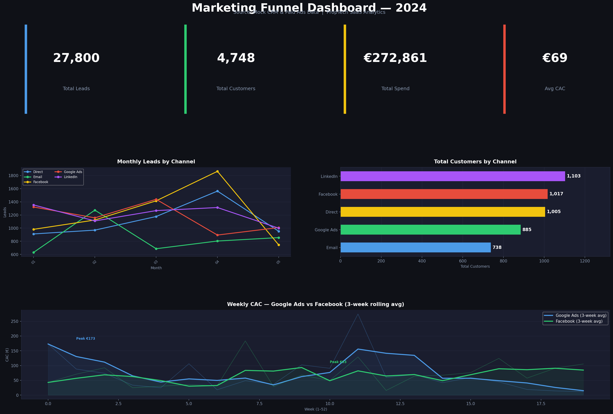

# 📊 Marketing Funnel Dashboard

A data analytics project simulating a real-world B2C marketing funnel for a PropTech SaaS startup (modelled on MYNE Homes-style co-ownership platforms).

## Dashboard Preview


## Business Context
Marketing teams in SaaS/PropTech startups need to track how leads move through their funnel — from first impression to paying customer — across multiple acquisition channels. This project builds the full analytics layer for that funnel.

## Tools Used
| Layer | Tool |
|---|---|
| Data Generation & Analysis | Python (Pandas, NumPy) |
| SQL Transformations | SQLite (4 analytical queries) |
| Visualisation | Matplotlib (dark theme dashboard) |
| Version Control | Git + GitHub |

## Key Metrics Tracked
- **Impressions → Clicks → Leads → Customers** (full funnel)
- **CTR** (Click-Through Rate)
- **CVR** (Lead Conversion Rate)
- **CAC** (Customer Acquisition Cost) per channel
- **Weekly & Monthly trend analysis**

## Project Structure
```
marketing-funnel-dashboard/
├── data/
│   ├── marketing_funnel_data.csv         # Raw mock dataset (260 rows, 52 weeks × 5 channels)
│   ├── query1_funnel_summary.csv         # SQL output: full funnel by channel
│   ├── query2_monthly_trend.csv          # SQL output: monthly leads & spend
│   ├── query3_weekly_cac_paid.csv        # SQL output: weekly CAC for paid channels
│   └── query4_peak_week.csv             # SQL output: best week per channel
├── notebooks/
│   ├── 01_funnel_analysis.py            # Python analysis script
│   ├── 02_sql_queries.py               # SQL queries via SQLite
│   ├── 03_dashboard.py                 # Matplotlib dashboard generator
│   └── dashboard_interactive.ipynb     # Jupyter notebook version
├── dashboards/
│   ├── funnel_dashboard.png            # Full dashboard export
│   ├── funnel_dashboard.pdf            # PDF version
│   ├── chart1_leads_by_channel.png     # Individual chart
│   └── chart2_cac_comparison.png       # Individual chart
└── README.md
```

## How to Run
1. Clone the repo: `git clone https://github.com/gauravbhatia-bit/marketing-funnel-dashboard`
2. Install dependencies: `pip install pandas numpy matplotlib`
3. Run analysis: `python notebooks/01_funnel_analysis.py`
4. Run SQL queries: `python notebooks/02_sql_queries.py`
5. Generate dashboard: `python notebooks/03_dashboard.py`

## Key Insights from the Data
- **Referral** channel drives the most customers (685) — highest conversion efficiency
- **Meta Ads** has highest CAC volatility — peak €1,269 in mid-year
- **Organic** channel delivers leads at zero cost — highest ROI channel
- **Google Ads** CAC peaked at €871 — indicates Q3 budget pressure
- Average funnel conversion rate: ~4.5% (click to customer)

## CV/Portfolio Description
> *"Built a marketing funnel analytics dashboard tracking 5 acquisition channels across 52 weeks, surfacing CAC trends and lead conversion rates for a PropTech SaaS startup using Python, SQL, and Matplotlib."*
